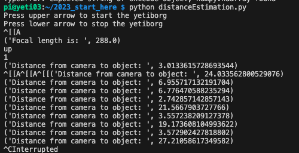

# Yeti Borg - Jarvis

The Yeti Borg is a Raspberry Pi controlled quad-car for programmed for object detection and avoidance. 

---
## Current issue

- [x] Distance is always 90
    * File: challenges/unknownObjectDetectionAndDistanceEstimation.py
    * Line 134: distance_to_camera alawys returns 90
    * Guide used for the code - https://pyimagesearch.com/2015/01/19/find-distance-camera-objectmarker-using-python-opencv/

    *Solved:*

    

- [ ] Logic for moving around object needs to be implemented
    * File: challenges/unknownObjectDetectionAndAvoidance.py
    * Line 173: function to be implemented

---

## Setup

1. Create a hostpot with specific name and password
2. SSH into the Pi

## Approach

*   Distance Estimation
    Measuring distance method - *triangle similarity*
    - marker on object (center of obj) - W
    - distance from camera to marker - D
    - measure apparent width in pixels - P
    - get focal length of camera - F

    At the start of the program, we define the object width(W) and initial distance predetermined distance(D). Then we take a picture and calculate the apparent width of the object(P) and then we calculate the focal length of the camera (F).

    Focal length formula: `F = (P x D) / W`

    Then in a contonious loop we take pictures and using the found focal length we measure the distance: `D’ = (W x F) / P`

## Jarvis Team

- Joana Trashlieva - s2905833@vuw.leidenuniv.nl 
- George Boukouvalas - g.boukouvalas@umail.leidenuniv.nl 
- Rosa Hoogenboom - hoogenboom@strw.leidenuniv.nl
- Victor IJnzonides - vynzonides@gmail.com

## Note
Project for the Robotics class in the Masters Computer Science track, Leiden University